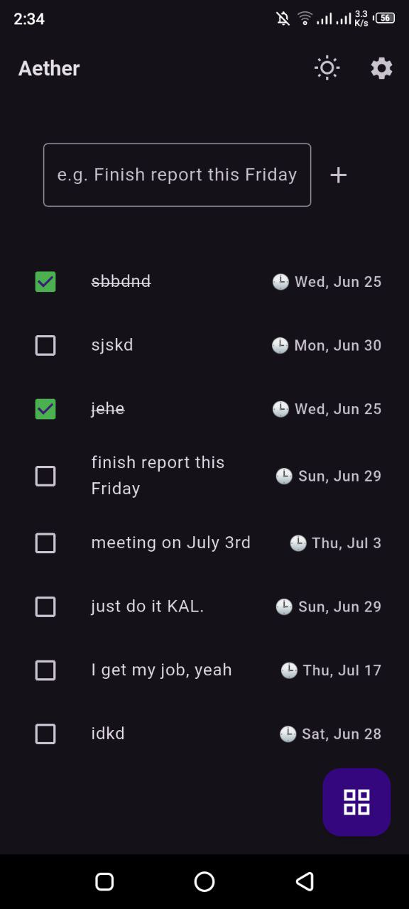
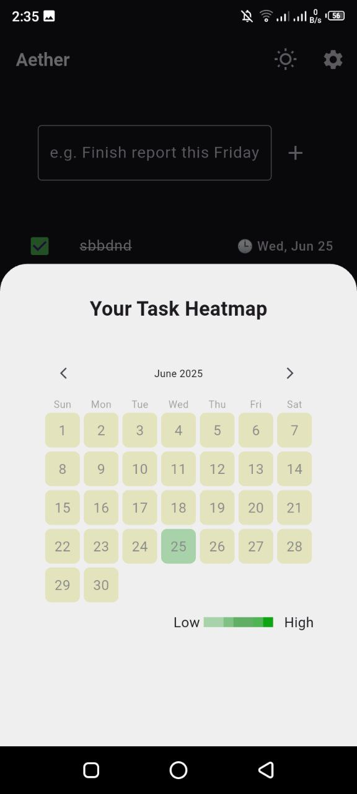

# ✅ Aether — Smart To-Do App with Heatmap, Deadlines & AI

Aether is AI-enhanced to-do list app built using **Flutter** and **Isar** database. It helps you manage tasks, track your productivity with a visual **heatmap**, and get personalized motivational feedback via **Gemini AI**.

---

## 🌟 Features

- ✅ Add tasks with natural-language deadlines (e.g. *"Finish report by Friday"*)
- 📆 Visualize completed tasks with a **calendar heatmap**
- ⏰ Set task deadlines manually or via smart text parsing
- 🎯 Auto-delete completed tasks after deadline is passed
- 🤖 Gemini AI integration to:
  - Analyze your weekly performance
  - Generate motivational messages
  - Send smart deadline reminders

---


## 📸 Screenshots

| Task Entry Page | Heatmap Tracker | AI Feedback |
|-----------------|-----------------|-------------|
|  |  |  |


---

## 🛠️ Technologies Used

- Flutter (UI Framework)
- Isar(local NoSQL database)
- Gemini API (Google AI for text analysis & generation)
- chrono_dart (natural-language date parsing)
- flutter_heatmap_calendar (visual tracker)
- intl & timezone (date formatting & conversion)
- flutter_local_notifications (smart reminders)

---

## 🚀 How It Works

1. **Add a task**  
   Type something like: `Finish portfolio by next Monday`

2. **AI parses deadline**  
   If a date is found (e.g. *next Monday*), the deadline is set automatically.

3. **Track tasks visually**  
   Tasks you mark as done color up the calendar in the heatmap.

4. **AI sends feedback**  
   Gemini analyzes your performance and sends motivation + reminders.

---t

## 🧠 AI Capabilities

| AI Feature        | Description                                         |
|-------------------|-----------------------------------------------------|
| Task Summary      | Tracks total, completed, overdue, and upcoming     |
| Motivational Tips | Daily/Weekly encouragement based on performance    |
| Smart Reminders   | Custom alerts based on task deadlines              |

---

## 📦 Getting Started

1. Clone this repo  
   ```bash
   git clone https://github.com/yourusername/aether_todo.git
   cd aether_todo
